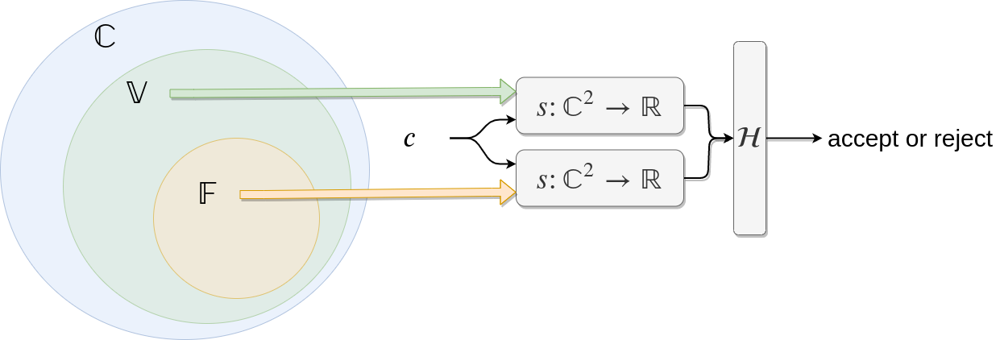

---
<div align="center">
 
# Proof of Novelty




[](https://openreview.net/forum?id=BJlfBONxnS)
[](https://figshare.com/articles/Proof_of_Novelty/10324883)
[](https://nbviewer.jupyter.org/github/dsevero/Proof-of-Novelty/blob/master/Proof-of-Novelty.pdf)
[](https://nbviewer.jupyter.org/github/dsevero/Proof-of-Novelty/blob/master/Proof-of-Novelty-slides.pdf)
</div>

We propose a design for securing novelty of archived content in distributed ledgers, called *Proof of Novelty*. What constitutes as novel is decided through a consensus mechanism together with a similarity function, which is selected according to the content type (e.g. full-motion videos, textual documents). Scalability is guaranteed by forming a validation committee with cryptographic sortition, which use statistical hypothesis testing to decide on the probability of a content being novel or not. The system can trade-off computational with statistical performance by manipulating parameters. We discuss the usage of this design to secure the novelty of full-motion videos and end with a proposal of future lines of research that can extended the systems capabilities.

## Citation
```
@article{Severo2019,
  author = "Daniel Severo",
  title = "{Proof of Novelty}",
  year = "2019",
  month = "11",
  url = "https://figshare.com/articles/Proof_of_Novelty/10324883",
  doi = "10.6084/m9.figshare.10324883.v1"
}
```

This short paper was written for the [VIRTUAL DESIGN CHALLENGE FOR AUTHENTICATING AND PROTECTING FULL MOTION VIDEOS](https://blockchain.ubc.ca/news/virtual-design-challenge-authenticating-and-protecting-full-motion-videos).
